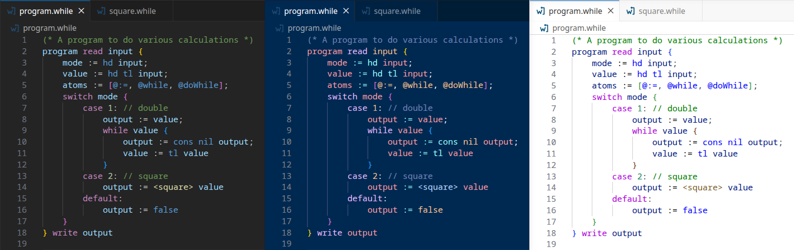
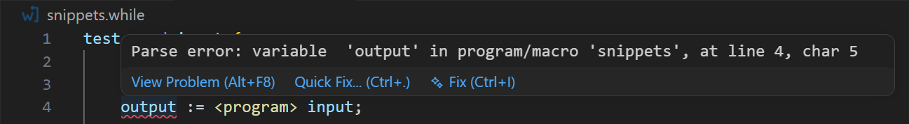
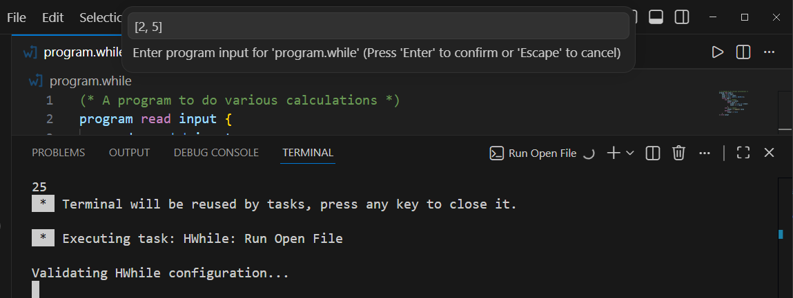
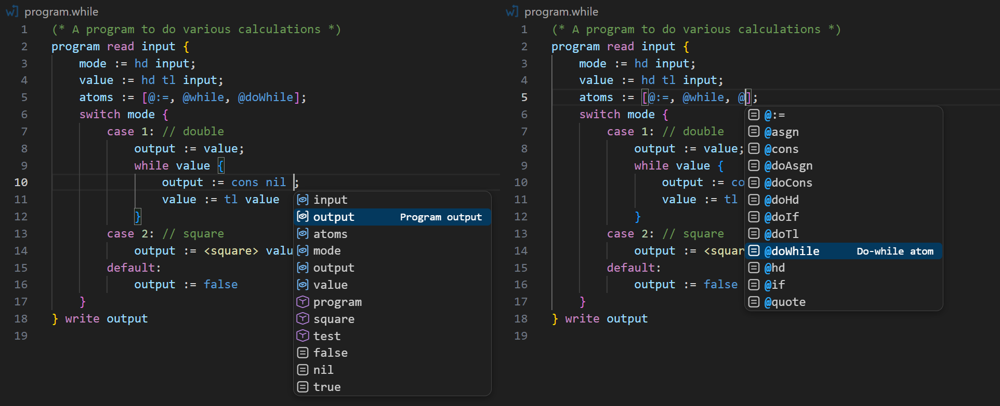
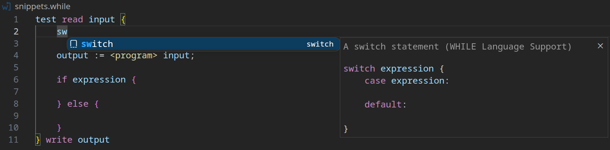
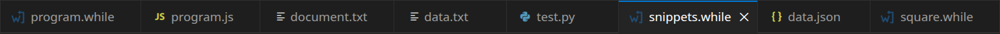

# WHILE Language Support

A Visual Studio Code extension to add support for the extended version of the WHILE programming language as described in [Limits of Computation: From a Programming Perspective - Bernhard Reus](https://limits.bernhardreus.com/). It applies to files with the `.while` extension.

It includes [HWhile](https://github.com/alexj136/HWhile) integration and compatibility with [whilers](https://github.com/jakkos-net/whilers) syntax.

This extension was designed as an alternative to the [while-syntax](https://github.com/davidpomerenke/while-syntax-vscode) VS Code extension.

## Features

### Syntax Highlighting
Adds a grammar for syntax highlighting of all extended while features with VS Code's built-in themes.

### HWhile Support
Adds integrations for running HWhile from within VSCode. A path to HWhile needs to be specified in the extension settings for it to work.
#### Debugger
Includes a debug adaptor for HWhile's interactive mode. This allows for stepping, breakpoints, and variable state inspection.

The program input, printmode (output type), file to use, and hwhile interpreter to use can be configured in `launch.json`.
#### Error Highlighting
Adds error highlighting for WHILE programs using HWhile's unparser mode. This can be disabled in the extension settings.

#### Tasks
Includes a task for running programs through HWhile more conveniently. It is accessible from the `Terminal > Run Task...` dialog, the `while-language-support.runOpenFileHWhile` command, or the play button in the top right of WHILE files.

The program input, printmode (output type), file to use, and hwhile interpreter to use can be configured in `tasks.json`.

### Auto-Completions
Adds completions for WHILE language features, detected variables and macros.

### Code Snippets
Includes several common code snippets including:
- **Program** definition
- **while** loops
- **if** and **if-else** statements
- **switch** statements
- **macro** calls

### Icon

A custom icon for more easily identifying `.while` files.

### Language Configuration

A VS Code language configuration for bracket auto-closing, auto-indentation, comment toggling and folding.

## Requirements

Some features of this extension require [HWhile](https://github.com/alexj136/HWhile). To set it up please download HWhile and set the path to it in the extension settings. If HWhile is located in your system's PATH then set `HWhile` as the path in settings.

## Extension Settings

This extension includes the following settings:
- `hwhile.executablePath`: The path to where the HWhile interpreter is located.
- `hwhile.printmode`: What printmode to use for HWhile if none is provided in `launch.json` or `tasks.json`.
- `hwhile.promptIfMissing`: Whether to prompt you to add a path to the HWhile interpreter on startup.
- `hwhile.Linting`: Whether to use HWhile's unparser mode for linting.
- `while.maxParseSize`: The maximum size for a file to be parsed for completions.

## Release Notes

### 1.0.0

Initial release of WHILE Language Support.